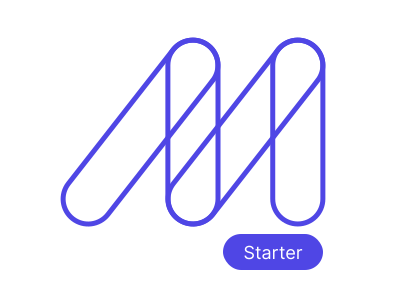

<div align="center">
  <p>
    <a href="https://maizzle.com/#gh-light-mode-only" target="_blank">
      
    </a>
    <a href="https://maizzle.com/#gh-dark-mode-only" target="_blank">
      
    </a>
  </p>
  <p>Syntax highlighting in HTML email with PrismJS</p>
</div>

## About

This is the repo for the [How to add PrismJS syntax highlighting to HTML emails](https://maizzle.com/guides/syntax-highlighting-prismjs) Maizzle guide.


## Getting Started

Install the Maizzle CLI:

```sh
npm install -g @maizzle/cli
```

Scaffold a new project with this starter:

```sh
maizzle new prismjs
```

Alternatively, you may clone this starter directly:

```bash
# remember to install dependencies with `npm install`
npx degit maizzle/starter-prismjs
```

## Development

Start a local development server:

```
npm run dev
```

Build for production:

```
npm run build
```

Maizzle documentation is available at https://maizzle.com
